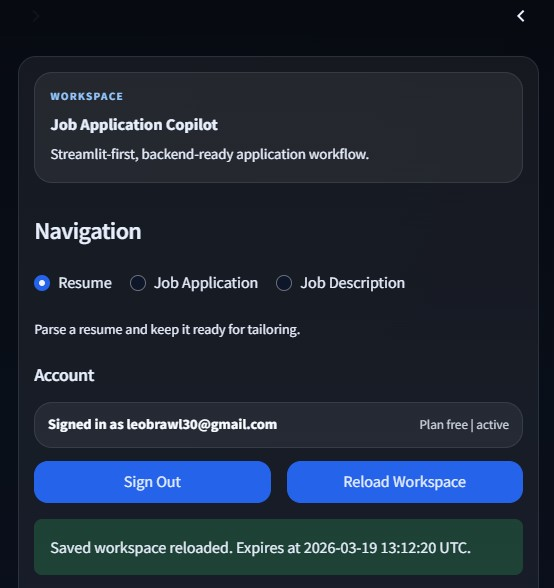
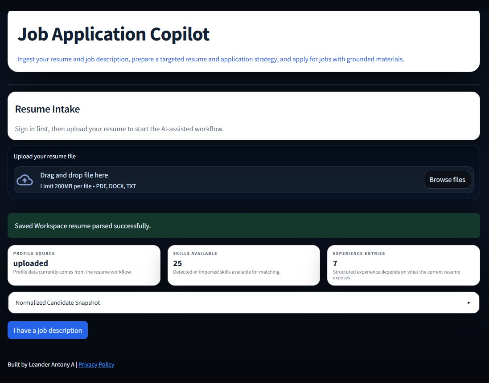
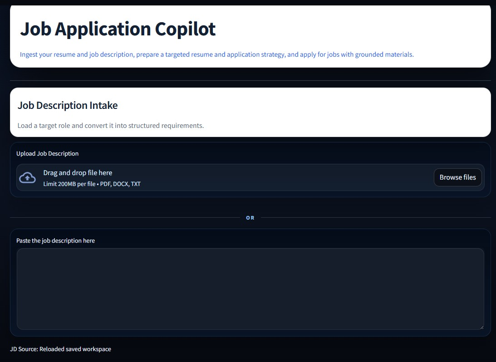
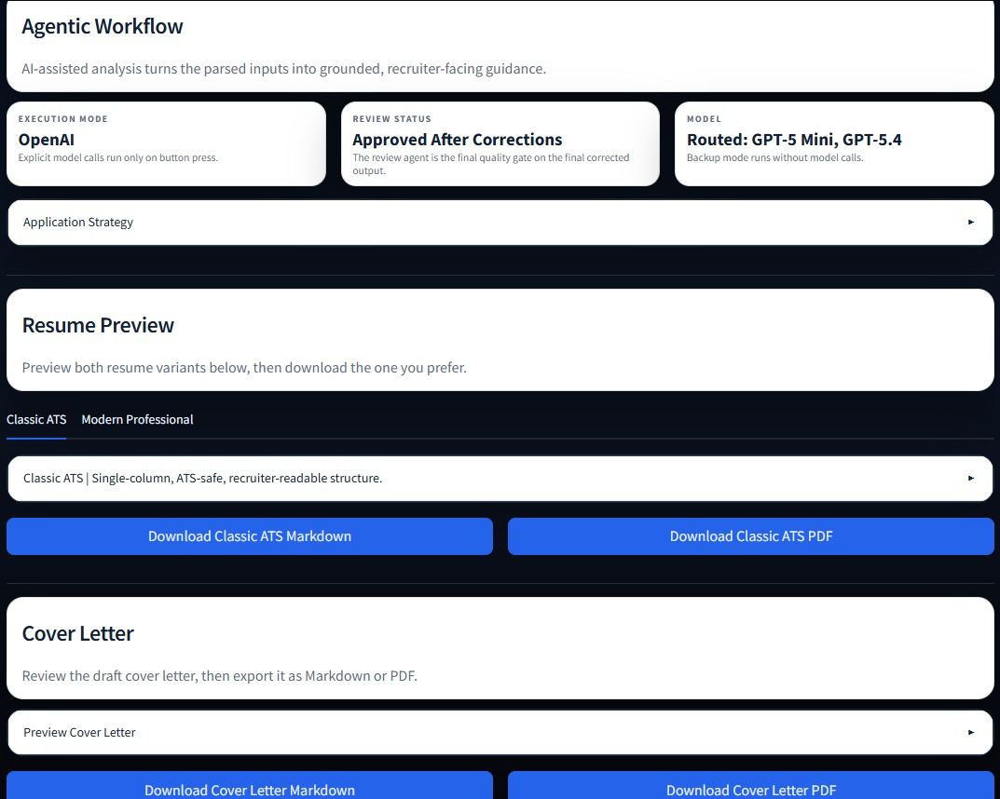
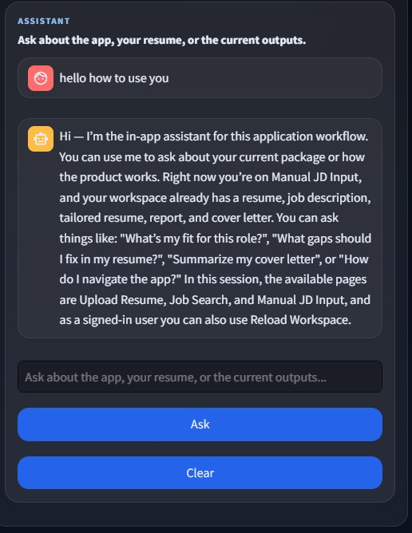
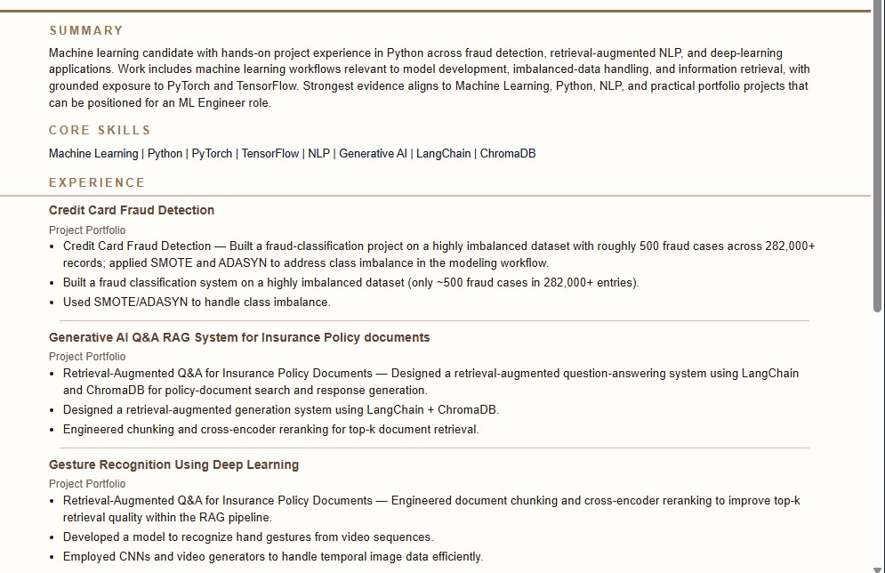
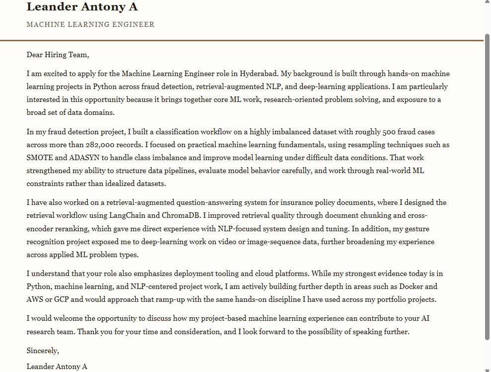

# AI Job Application Agent

[](https://github.com/LEANDERANTONY/AI_Job_Application_Agent/actions/workflows/ci.yml)
[](LICENSE)
[](https://ai-job-application-agent.onrender.com/)

AI Job Application Agent is a Streamlit app that turns a resume and target role into a grounded job-application workflow: fit analysis, tailored resume, cover letter, application strategy report, and in-app assistant support.

Live app: [ai-job-application-agent.onrender.com](https://ai-job-application-agent.onrender.com/)

## What It Does

- Parses resumes from PDF, DOCX, or TXT and builds a normalized candidate profile
- Structures job descriptions into title, requirements, skills, and experience signals
- Searches technical roles across configured Greenhouse boards and Lever sites
- Imports supported job postings directly from job links into the JD workflow
- Lets signed-in users keep a shortlist of saved jobs for later review
- Runs a supervised agentic workflow for fit, tailoring, strategy, review, resume generation, and cover letter generation
- Produces three exportable artifacts:
  - tailored resume
  - cover letter
  - application strategy report
- Uses Google sign-in via Supabase for AI features, saved workspace reload, and persisted daily quota tracking
- Keeps one latest saved workspace per signed-in user and restores it through the sidebar `Reload Workspace` action

## Product Flow

1. Sign in with Google
2. Upload your resume
3. Search jobs, paste a supported job link, or paste/upload a job description manually
4. Review the JD summary, requirements, and imported job details
5. Run the agentic analysis
6. Review the tailored resume, cover letter, and application strategy
7. Ask the assistant grounded questions about the app or current outputs
8. Download Markdown or PDF artifacts

## UI Preview

### 1. Sign In And Load Inputs







### 2. Search Or Import A Job


### 3. Run The Agentic Workflow



### 4. Ask Grounded Follow-Up Questions



### 5. Review The Generated Outputs





## Sample Exports

- Application strategy PDF: [docs/pdf_rendered/application_strategy_render.pdf](docs/pdf_rendered/application_strategy_render.pdf)
- Tailored resume PDF: [docs/pdf_rendered/classic_resume_render.pdf](docs/pdf_rendered/classic_resume_render.pdf)
- Cover letter PDF: [docs/pdf_rendered/cover_letter_render.pdf](docs/pdf_rendered/cover_letter_render.pdf)

## Stack

- Streamlit UI
- OpenAI Responses API for assisted generation
- Supabase for Google auth, persisted usage, saved workspace storage, and saved-job shortlist persistence
- FastAPI job-search backend for provider-owned search and job resolution
- WeasyPrint-first PDF generation with fallback handling in code
- `uv` for environment and dependency management

## Deployment Shape

- Streamlit web app for the main product shell
- FastAPI web service for job search and direct job resolution
- Supabase for auth, persisted quota state, saved workspace snapshots, and saved-job shortlist storage
- Render Blueprint in [render.yaml](C:/Users/Leander%20Antony%20A/Documents/Projects/AI_Job_Application_Agent/render.yaml) for the two-service deployment path on the feature branch

## Local Smoke Test

Run the backend first:

```powershell
uv run uvicorn backend.app:app --reload --host 127.0.0.1 --port 8000
```

Then start the Streamlit app in a second terminal:

```powershell
uv run streamlit run app.py
```

Recommended local env values for the branch:

```env
ENABLE_JOB_SEARCH_BACKEND=true
JOB_BACKEND_BASE_URL=http://127.0.0.1:8000
GREENHOUSE_BOARD_TOKENS=narvar,gleanwork,wayve,datadog,moloco,figma,qualtrics,thumbtack,placerlabs,zscaler,coinbase,typeface
LEVER_SITE_NAMES=dnb,plaid,mistral
```

Minimum checks:

1. Open `http://127.0.0.1:8000/api/health` and confirm provider counts are present.
2. Search for a broad technical query such as `software engineer` in the app.
3. Preview a result, import it into the JD flow, and confirm the review panel renders.
4. Save a job to the shortlist and confirm it appears in `Saved Jobs`.
5. Reload a saved workspace and confirm imported job context still returns.

## Hosted Rollout Validation

When the branch is ready for a real hosted test:

1. Deploy the two-service Render Blueprint from [render.yaml](C:/Users/Leander%20Antony%20A/Documents/Projects/AI_Job_Application_Agent/render.yaml).
2. Keep `ENABLE_JOB_SEARCH_BACKEND=true` only on the branch deployment, not on the current production app.
3. Confirm the backend health endpoint returns:
   - `status: ok`
   - provider readiness under `providers.greenhouse` and `providers.lever`
4. Verify the Streamlit service receives `JOB_BACKEND_HOSTPORT` from the backend service over Render private networking.
5. Test `search -> preview -> import -> shortlist -> reload workspace` end to end before any merge to `main`.
