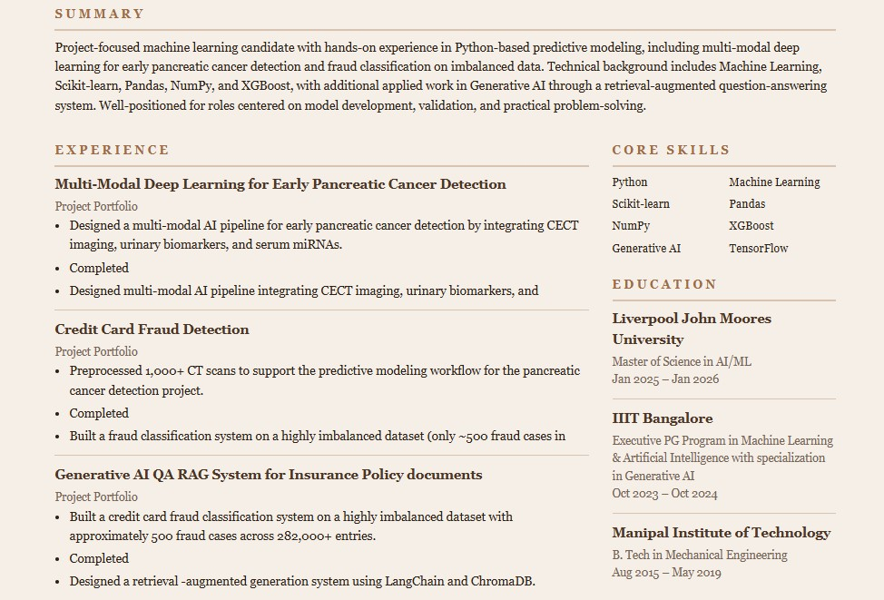

# AI Job Application Agent

**A grounded job-application copilot.** Search live listings across four ATS providers, paste a job description and see it parsed into hard / soft / must-have skills, and run a five-stage supervised pipeline that produces a tailored resume + cover letter — every claim anchored to evidence from the source resume.

**Live:** [job-application-copilot.xyz](https://job-application-copilot.xyz) · **Workspace:** [app.job-application-copilot.xyz](https://app.job-application-copilot.xyz)

---

## What's actually inside

| System | What it does |
|--------|--------------|
| **Live job search** | Cached index of ~12,000 open roles from Greenhouse, Lever, Ashby, and Workday — refreshed every 30 minutes. Filter by company, work mode, role type, posted-within. Sort by relevance, recency, or alphabetical. |
| **Resume intake** | Upload PDF / DOCX / TXT, or chat one into existence with the conversational builder. Parsed into a normalized profile with skills, experience timeline, projects, publications, and certifications. |
| **JD review** | LLM-first JD parser with regex fallback. Surfaces hard skills, soft skills, and must-haves; shows match score against the loaded resume. |
| **Supervised pipeline** | Matchmaker → Forge (tailoring) → Gatekeeper (review) → Resume Generation → Cover Letter. Three-layer LLM retry stack with per-agent fallback isolation, deterministic floor on every stage. |
| **Artifact export** | Two themes (`classic_ats` for ATS parsers, `professional_neutral` for human readers) in DOCX or PDF. The same source data feeds either pathway. |
| **Grounded assistant** | Floating workspace chat with full context of the loaded resume, JD, analysis state, and saved jobs. Streams answers as they generate. |
| **Command palette** | `⌘K` / `Ctrl+K` from anywhere — jump between steps, load a saved job, re-ask a recent assistant question, or run the analysis. |

---

## Visual tour

| Step 03 — Job Detail (parsed JD with match score + skill chips) | Step 01 — Resume builder (chat one into existence) |
|---|---|
|  |  |

| Output — `classic_ats` theme | Output — `professional_neutral` theme | Output — Cover letter |
|---|---|---|
|  |  |  |

---

## How job discovery works

The cached jobs layer lives in Postgres (`cached_jobs` table) and is refreshed by a scheduled worker that fans out across all four sources. Highlights:

- **~117 Greenhouse boards** + **30 Lever sites** + **36 Ashby boards** + **11 Workday Fortune-500 tenants** in the active source pool.
- **30-minute refresh cadence** via `pg_net` cron triggering the `/admin/refresh-cache` endpoint.
- **Relevance-ranked search** through a Postgres RPC that combines query token coverage with recency.
- **Saved-jobs drawer** with a 24-hour TTL — bookmarks survive page reloads but expire if you don't act on them, with an `EXPIRED` badge so nothing silently disappears.

See [ADR-013](docs/adr/ADR-013-cached-jobs-cache-layer-with-scheduled-refresh.md) and [ADR-014](docs/adr/ADR-014-postgres-rpc-for-ranked-search.md) for the load-bearing decisions.

## How the supervised pipeline works

`ApplicationOrchestrator._run_pipeline` runs five stages with progress callbacks, per-stage duration logging, JSON-contracted agent outputs, and per-agent fallback isolation:

1. **Matchmaker** (deterministic) — `build_fit_analysis()` compares the candidate profile against the JD and produces matched / missing skills.
2. **Forge** (`TailoringAgent`) — rewrites the deterministic baseline into role-specific resume guidance.
3. **Gatekeeper** (`ReviewAgent`) — checks grounding, reports unsupported claims, and returns corrected tailoring when repairs are possible.
4. **Resume generation** (`ResumeGenerationAgent`) — builds the final tailored resume artifact from the reviewed output.
5. **Cover letter** (`CoverLetterAgent`) — runs only after review approval and produces a role-specific cover letter.

Each agent follows the same operating shape: deterministic baseline first, LLM-assisted refinement second, structured JSON output, and a deterministic fallback when assisted execution is unavailable. **Per-agent fallback isolation** means a single failing agent falls back independently — the other three keep their LLM-quality output. See [ADR-018](docs/adr/ADR-018-three-layer-llm-retry-and-per-agent-fallback-isolation.md) for the three-layer retry stack (SDK retry × 2 + app-level retry + per-agent retry).

## How grounding works

- Deterministic services build the candidate profile, JD summary, fit analysis, and first-pass tailored draft before the agent layer runs.
- `ReviewAgent` returns `grounding_issues`, `unresolved_issues`, `revision_requests`, and an optional `corrected_tailoring` payload.
- The orchestrator uses `corrected_tailoring` as the downstream source of truth when review repairs the draft.
- Cover-letter generation is gated on review approval.
- The fallback review path checks whether the output references missing hard skills that aren't evidenced in the source profile.

## Workspace assistant

A floating chat surface that's grounded in your live workspace state. Answers are streamed token-by-token via Server-Sent Events. The model sees:

- `current_step` (which step you're standing on)
- `has_resume` / `has_jd` / `has_analysis` flags
- Compact resume + JD summaries (counts and identity, no raw text)
- Saved jobs count + last search query

So "what should I do next?" returns three different correct answers across the cold-start / mid-flow / ready-to-run personas. See [ADR-017](docs/adr/ADR-017-workspace-assistant-state-aware-context.md).

## Product surface

1. Sign in with Google through Supabase-backed auth
2. Upload a resume or build one through the conversational assistant
3. Search the cached job index, paste a posting URL, or open a saved bookmark
4. Review the parsed JD with hard / soft / must-have skill chips
5. Run the supervised pipeline; watch agent stages stream in real time
6. Review the tailored resume + cover letter side-by-side
7. Ask grounded follow-up questions in the workspace assistant
8. Export DOCX or PDF in either theme

## Engineering notes

- **44 Python test files** cover parsing, normalization, fitting, tailoring, orchestration, builders, exports, auth, quotas, persistence, error handling, and the four ATS adapters.
- **Quality runners** in `tests/quality/` produce evidence for each LLM-driven stage (parser, tailoring, review, resume gen, cover letter, assistant, JD parser, latency baseline).
- **19 ADRs** in `docs/adr/` record the architectural decisions, including the Streamlit-first → Next.js + FastAPI transition (ADR-012), DOCX-first export (ADR-015), conversational builder (ADR-016), state-aware assistant (ADR-017), and three-layer retry stack (ADR-018).
- **Architecture details** live in [docs/architecture.md](docs/architecture.md).
- **Design system reference** lives in [`design_system/`](design_system/) — the shipped Direction-B handoff prototype, per-screen specs (chrome + 4 steps), and the landing page spec set.

## Deployment

- `app.job-application-copilot.xyz` → Vercel-hosted Next.js workspace
- `api.job-application-copilot.xyz` → VPS-hosted FastAPI backend
- `frontend/` → Next.js + React 19 + Turbopack
- `backend/` → FastAPI + Uvicorn, async OpenAI client, Supabase Postgres
- `backend/vps/` → Docker Compose + Caddy bundle for the backend stack
- `src/` → shared Python core (orchestrator, agents, builders, schemas, services)
