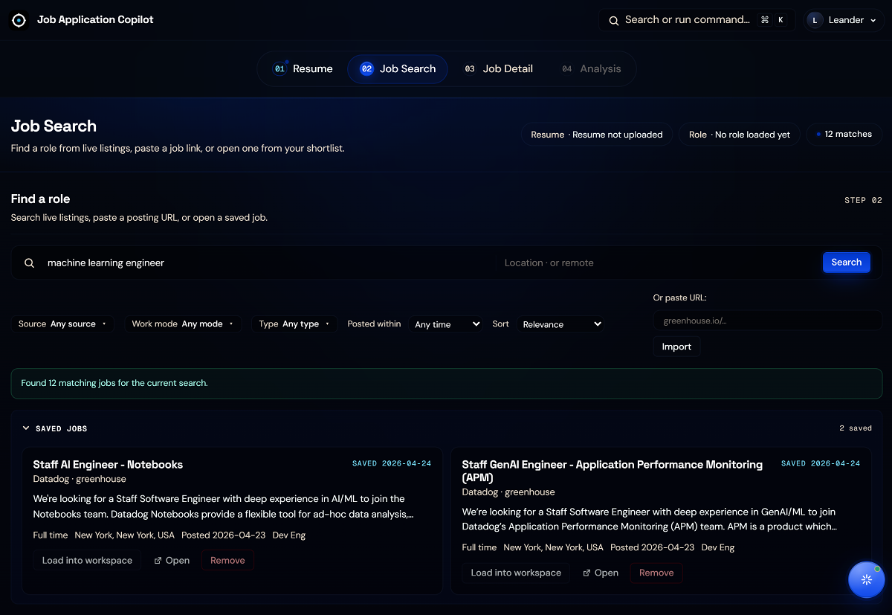
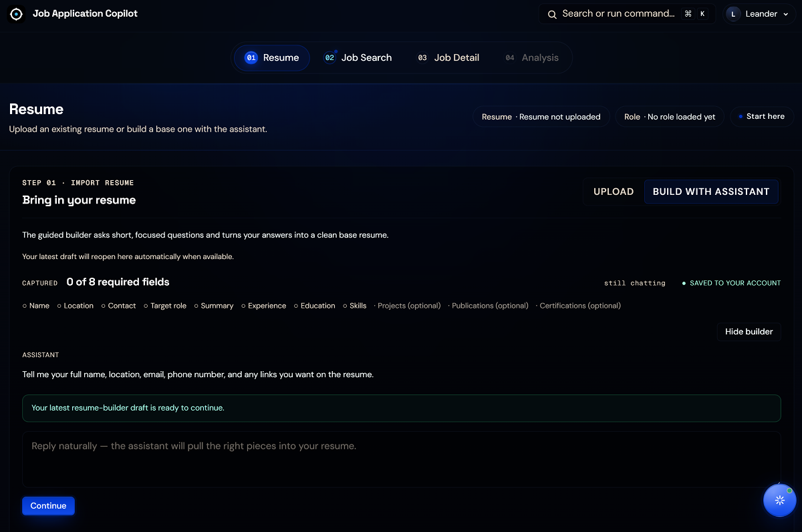
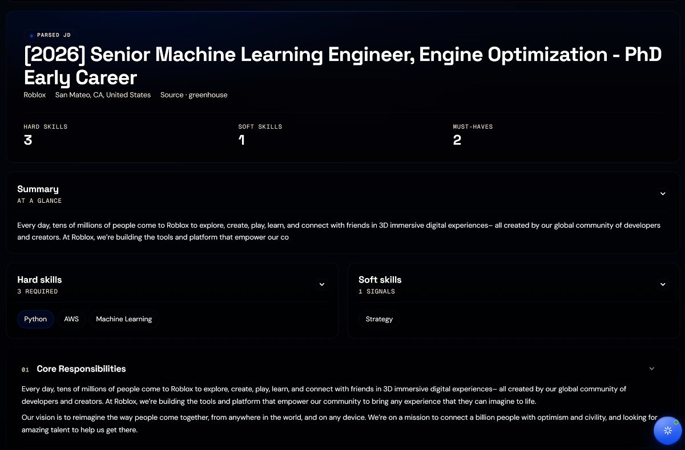

# AI Job Application Agent

**A grounded job-application copilot.** Search live listings across four ATS providers, paste a job description and see it parsed into hard / soft / must-have skills, and run a five-stage supervised pipeline that produces a tailored resume + cover letter — every claim anchored to evidence from the source resume.

**Live:** [job-application-copilot.xyz](https://job-application-copilot.xyz) · **Workspace:** [app.job-application-copilot.xyz](https://app.job-application-copilot.xyz)

---

## Visual tour

| Step 01 — Resume builder (chat one into existence) | Step 03 — Job Detail (parsed JD with match score + skill chips) |
|---|---|
|  |  |

| Output — `classic_ats` theme | Output — Cover letter |
|---|---|
|  |  |

---

## What's actually inside

| System | What it does |
|--------|--------------|
| **Live job search** | Cached index of ~12,000 open roles from Greenhouse, Lever, Ashby, and Workday — refreshed every 4 hours. Filter by company, work mode, role type, posted-within. Sort by relevance, recency, or alphabetical. |
| **Resume intake** | Upload PDF / DOCX / TXT, or chat one into existence with the conversational builder. Parsed into a normalized profile with skills, experience timeline, projects, publications, and certifications. |
| **JD review** | LLM-first JD parser with regex fallback. Surfaces hard skills, soft skills, and must-haves; shows match score against the loaded resume. |
| **Supervised pipeline** | Matchmaker → Forge (tailoring) → Gatekeeper (review) → Resume Generation → Cover Letter. Three-layer LLM retry stack with per-agent fallback isolation, deterministic floor on every stage. |
| **Artifact export** | Two themes (`classic_ats` for ATS parsers, `professional_neutral` for human readers) in DOCX or PDF. The same source data feeds either pathway. |
| **Grounded assistant** | Floating workspace chat with full context of the loaded resume, JD, analysis state, and saved jobs. Streams answers as they generate. |
| **Command palette** | `⌘K` / `Ctrl+K` from anywhere — jump between steps, load a saved job, re-ask a recent assistant question, or run the analysis. |
| **Tier enforcement** | Per-(user, period, counter) atomic quota gates on every gated action (tailored applications, premium applications, assistant turns, resume parses, resume-builder sessions, job searches, saved jobs, saved workspaces). Free / Pro / Business cap matrix. Premium opt-in routes review + resume-gen + cover-letter to `gpt-5.5` while keeping tailoring on mini for COGS reasons. Refund-on-failure so a transient workflow error doesn't burn a credit. |

---

## How job discovery works

The cached jobs layer lives in Postgres (`cached_jobs` table) and is refreshed by a scheduled worker that fans out across all four sources. Highlights:

- **~117 Greenhouse boards** + **30 Lever sites** + **36 Ashby boards** + **11 Workday Fortune-500 tenants** in the active source pool.
- **4-hour refresh cadence** via `pg_net` cron triggering the `/admin/refresh-cache` endpoint (6 refreshes per day at 00:00 / 04:00 / 08:00 / 12:00 / 16:00 / 20:00 UTC).
- **Relevance-ranked search** through a Postgres RPC that combines query token coverage with recency.
- **Saved-jobs drawer** with a 24-hour TTL — bookmarks survive page reloads but expire if you don't act on them, with an `EXPIRED` badge so nothing silently disappears.

See [ADR-013](docs/adr/ADR-013-cached-jobs-cache-layer-with-scheduled-refresh.md) and [ADR-014](docs/adr/ADR-014-postgres-rpc-for-ranked-search.md) for the load-bearing decisions.

## How the supervised pipeline works

`ApplicationOrchestrator._run_pipeline` runs five stages with progress callbacks, per-stage duration logging, JSON-contracted agent outputs, and per-agent fallback isolation:

1. **Matchmaker** (deterministic) — `build_fit_analysis()` compares the candidate profile against the JD and produces matched / missing skills.
2. **Forge** (`TailoringAgent`) — rewrites the deterministic baseline into role-specific resume guidance.
3. **Gatekeeper** (`ReviewAgent`) — checks grounding, reports unsupported claims, and returns corrected tailoring when repairs are possible.
4. **Resume generation** (`ResumeGenerationAgent`) — builds the final tailored resume artifact from the reviewed output.
5. **Cover letter** (`CoverLetterAgent`) — runs only after review approval and produces a role-specific cover letter.

Each agent follows the same operating shape: deterministic baseline first, LLM-assisted refinement second, structured JSON output, and a deterministic fallback when assisted execution is unavailable. **Per-agent fallback isolation** means a single failing agent falls back independently — the other three keep their LLM-quality output. See [ADR-018](docs/adr/ADR-018-three-layer-llm-retry-and-per-agent-fallback-isolation.md) for the three-layer retry stack (SDK retry × 2 + app-level retry + per-agent retry).

## How grounding works

- Deterministic services build the candidate profile, JD summary, fit analysis, and first-pass tailored draft before the agent layer runs.
- `ReviewAgent` returns `grounding_issues`, `unresolved_issues`, `revision_requests`, and an optional `corrected_tailoring` payload.
- The orchestrator uses `corrected_tailoring` as the downstream source of truth when review repairs the draft.
- Cover-letter generation is gated on review approval.
- The fallback review path checks whether the output references missing hard skills that aren't evidenced in the source profile.

## Engineering notes

- **61 Python test files** cover parsing, normalization, fitting, tailoring, orchestration, builders, exports, auth, quotas, persistence, the Lemon Squeezy webhook, voice transcription, artifact feedback, prompt-registry byte-identity, error handling, and the four ATS adapters.
- **Quality runners** in `tests/quality/` produce evidence for each LLM-driven stage (parser, tailoring, review, resume gen, cover letter, assistant, JD parser, latency baseline). `backend/nightly_eval.py` wraps them into a single regression-checked batch — manual-only at pre-revenue stage by design, see [ADR-026](docs/adr/ADR-026-manual-only-nightly-eval-at-pre-revenue-stage.md).
- **Every LLM prompt loads from a versioned JSON registry** (`prompts/<name>/v1.json`) — all 11 builders migrated off Python f-string concats, each guarded by a byte-identity test so a template can't silently drift from its original.
- **27 ADRs** in `docs/adr/` record the architectural decisions, including the Streamlit-first → Next.js + FastAPI transition (ADR-012), DOCX-first export (ADR-015), conversational builder (ADR-016), state-aware assistant (ADR-017), three-layer retry stack (ADR-018), independent step navigation (ADR-019), tier resolution shim (ADR-020), atomic quota with refund (ADR-021), tier-aware model selection (ADR-022), Lemon Squeezy as Merchant of Record for v1 (ADR-023), the observability stack (ADR-024), the EU cookie consent banner (ADR-025), manual-only nightly eval (ADR-026), and the tier-gated export entitlement (ADR-027).
- **Architecture details** live in [docs/architecture.md](docs/architecture.md); the day-2 operational runbook in [docs/deployment.md](docs/deployment.md).

## Deployment

- `app.job-application-copilot.xyz` → Vercel-hosted Next.js workspace
- `api.job-application-copilot.xyz` → VPS-hosted FastAPI backend
- `frontend/` → Next.js + React 19 + Turbopack
- `backend/` → FastAPI + Uvicorn, async OpenAI client, Supabase Postgres
- `backend/vps/` → Docker Compose + Caddy bundle for the backend stack
- `src/` → shared Python core (orchestrator, agents, builders, schemas, services)

## Production stack

| Layer | Choice | Notes |
|-------|--------|-------|
| **Frontend** | Next.js on Vercel | Auto-deploys from `main`; source maps uploaded to Sentry on every deploy |
| **Backend** | FastAPI in Docker on an EU VPS, fronted by Caddy | The reverse-proxy block is committed in `backend/vps/Caddyfile` — runtime-only Caddy config is wiped on restart |
| **Data** | Supabase (EU region) | Auth (Google OAuth), per-user persistence, the `cached_jobs` index, quota counters, subscriptions, and the `aijobagent_run_traces` cost-attribution table |
| **Scheduled work** | Supabase `pg_cron` + `pg_net` | `cached_jobs` refresh every 4h; expired resume-builder-session cleanup every 5 min. **Nothing scheduled spends OpenAI tokens** — the only LLM-spending job (`nightly_eval`) is deliberately manual-only |
| **Error + perf** | Sentry (`jobagent-backend` + `jobagent-frontend`) | Error tracking + traces + AI Agents Monitoring (token/cost/latency spans, no prompt-body PII) + Logs + errors-only session replay + a 5-min EU Uptime monitor. Always-on as legitimate interest |
| **Product analytics** | PostHog (EU, free Developer plan) | Autocapture + heatmaps + consent-gated session replay; every event tagged `product: "jobagent"`. Consent-gated per GDPR/ePrivacy |
| **Payments** | Lemon Squeezy (Merchant of Record) | Scaffolded + HMAC-verified webhook live; env-gated behind a "Coming soon" frontend fallback until the dashboard's final variant IDs land |

**GDPR posture:** a custom in-house cookie consent banner is the gate. Sentry error tracking + traces + Feedback load always (legitimate interest, GDPR Art. 6(1)(f) — crash reporting is operationally necessary). PostHog analytics + PostHog replay + Sentry Session Replay load only after explicit opt-in (ePrivacy Art. 5(3)). No third-party JS loads before consent. See [ADR-024](docs/adr/ADR-024-observability-stack-sentry-and-posthog.md) and [ADR-025](docs/adr/ADR-025-eu-cookie-consent-banner-and-gdpr-analytics-gating.md).
