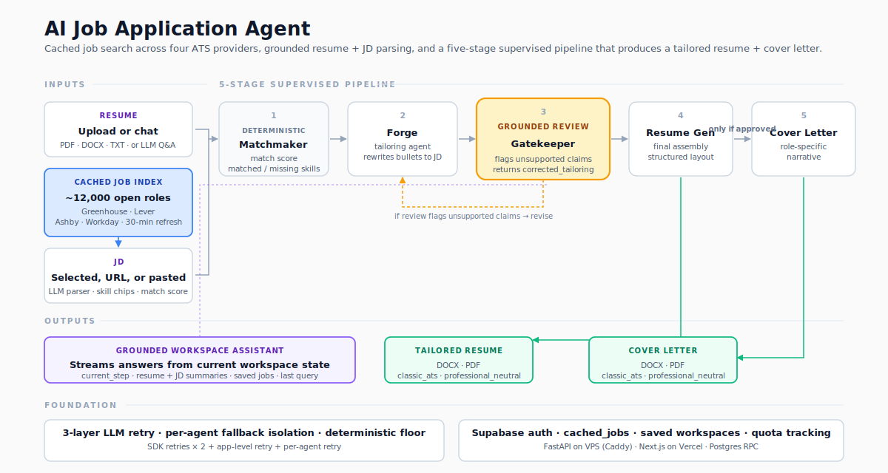

# AI Job Application Agent

AI Job Application Agent is a grounded job-application copilot with three first-class systems: integrated job discovery across Greenhouse and Lever boards, a five-agent tailoring pipeline built on deterministic baselines plus LLM refinement, and grounded review that revises or rejects unsupported claims before export.

The result is more than a paste-a-JD resume tool. It can search indexed job boards, match postings, tailor a resume and cover letter through supervised agents, and keep the final package anchored to evidence from the source profile.

Live landing page: https://job-application-copilot.xyz

Workspace app: https://app.job-application-copilot.xyz

## Job Discovery

The app can search configured Greenhouse and Lever boards before the agent workflow starts. The default local configuration indexes 12 Greenhouse boards and 3 Lever sites, normalizes postings through provider-specific clients, and ranks results through the matching layer before a selected JD enters the tailoring pipeline.

## Agent Pipeline

The workflow runs through `ApplicationOrchestrator` with progress callbacks, per-stage duration logging, JSON-contracted agent outputs, and deterministic fallback if assisted generation is unavailable.

1. `FitAgent` compares the candidate profile against the job description.
2. `TailoringAgent` rewrites the deterministic baseline into role-specific resume guidance.
3. `ReviewAgent` checks grounding, reports unsupported claims, and returns corrected tailoring when repairs are possible.
4. `ResumeGenerationAgent` builds the final tailored resume artifact from the reviewed output.
5. `CoverLetterAgent` runs only after review approval and creates a role-specific cover letter.

Each agent follows the same operating shape: deterministic baseline first, LLM-assisted refinement second, structured JSON output, and grounded fallback behavior when assisted execution is unavailable.

## Grounding And Fallbacks

- Deterministic services build the candidate profile, JD summary, fit analysis, and first-pass tailored draft before the agent layer runs.
- `ReviewAgent` returns `grounding_issues`, `unresolved_issues`, `revision_requests`, and an optional `corrected_tailoring` payload.
- The orchestrator uses `corrected_tailoring` as the downstream source of truth when review repairs the draft.
- Cover-letter generation is gated on review approval.
- The fallback review path checks whether the output references missing hard skills that are not evidenced in the source profile.

## Prompt And Runtime Discipline

- Prompt builders compact large JSON sections through escalating string and list caps before falling back to a section summary.
- Prompt metadata records estimated input size, compacted section count, compacted labels, and budget mode.
- The OpenAI wrapper routes by task, tracks usage, enforces quota checks, records response metadata, and retries incomplete JSON responses with a higher output budget when appropriate.

## Product Surface

1. Sign in with Google through Supabase-backed auth
2. Upload a resume and build a normalized candidate profile
3. Search Greenhouse and Lever boards, import a supported posting, or paste a JD manually
4. Review a structured JD summary
5. Run the grounded agentic workflow
6. Review the tailored resume and cover letter
7. Ask grounded follow-up questions in the workspace assistant
8. Export Markdown or WeasyPrint-backed PDF documents

## Engineering Notes

- 37 focused Python test files cover parsing, normalization, fitting, tailoring, orchestration, builders, exports, auth, quotas, persistence, and backend routes.
- 12 ADRs in `docs/adr/` record product and architecture decisions, including the Streamlit-first to Next.js + FastAPI transition.
- Architecture details live in [docs/architecture.md](docs/architecture.md).
- Deployment notes live in [docs/next-fastapi-transition.md](docs/next-fastapi-transition.md).

## Deployment Shape

- `app.job-application-copilot.xyz` -> Vercel frontend
- `api.job-application-copilot.xyz` -> VPS FastAPI backend
- `deploy/vps/` -> Docker Compose + Caddy bundle for the backend stack
